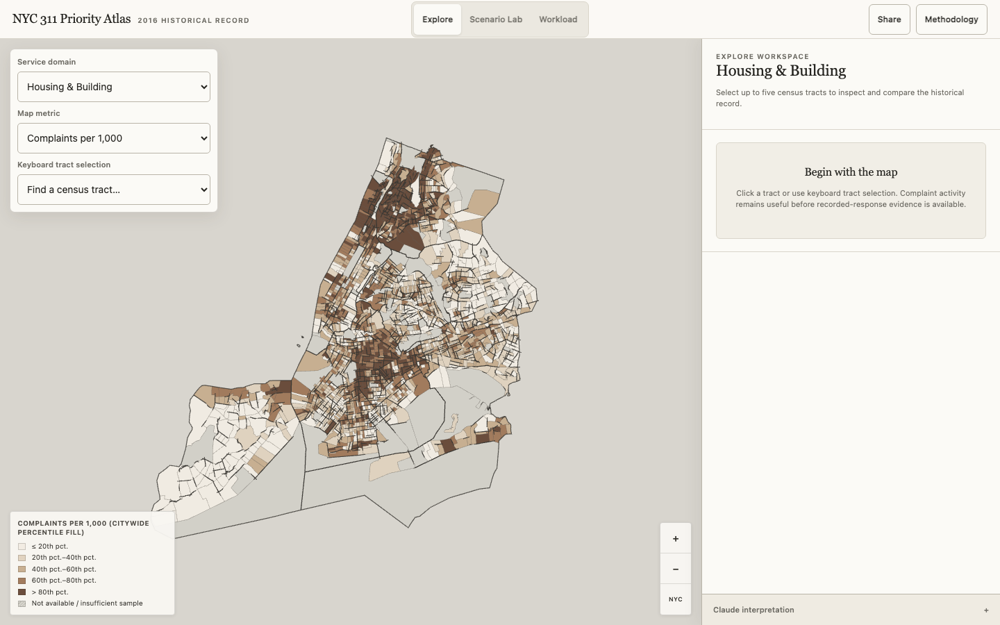

# NYC 311 Priority Atlas

**Live:** [_Production URL pending deployment._](https://nyc311-priority-atlas.vercel.app/)

NYC 311 Priority Atlas is a map-first product that links historical 311 requests with census-tract population, income, geography, neighborhood context, transparent priority scenarios, and workload aging. It is for public agencies, nonprofits, researchers, and community organizations that need a shared way to compare places, test assumptions, and frame questions for deeper investigation—not a live operations dashboard or recommendation engine.

## How Claude is used

All statistics are computed deterministically before Claude is called. Claude receives those results as locked reference tokens, and server guardrails reject any response containing a number it was not handed. It can explain figures, compare supplied context, and draft clearly labeled hypotheses, but it cannot replace a calculation, change scenario membership, or apply a proposed interface action without the user pressing **Apply**. Claude interprets figures; it never generates them. Without an API key, every manual workflow still works.

## Limitations

- **NYCHA coverage is incomplete.** Standard 311 housing data do not fully represent New York City Housing Authority in-unit repair workflows.
- **The data are from 2016.** The Atlas describes a fixed historical cohort, not current NYC conditions.
- **Reporting propensity matters.** Complaint volume reflects what was reported through 311, not a direct measurement of true need or the prevalence of a condition.
- **Recorded closure is not actual resolution.** A Closed Date records an administrative action and does not establish that the physical condition was fixed.
- **Response evidence can be sparse or invalid.** Tract-specific closure and workload results are suppressed below 30 known timing outcomes; closure dates earlier than creation dates are excluded.
- **The workload model is bounded by one historical year.** Its final six-day period is excluded from resampling, request-age results describe a cohort rather than accumulated future arrivals, and uncertainty does not cover structural change. What-if results are assumptions, not forecasts or causal estimates.
- **Priority settings remain analytical choices.** Scaling methods can select different tracts, and the number selected does not represent staff, budgets, cases, inspections, or operational capacity.
- **Tract summaries simplify place.** They can hide variation within a tract; low-population tracts remain visible but are excluded from priority scoring, and six otherwise eligible tracts lack the income value required by that score.

## From research to product

The Atlas grew from the [`nyc311urbandata`](https://github.com/mylwzz/nyc311urbandata) analysis project and its paper, [*Patterns in the Noise*](https://github.com/mylwzz/nyc311urbandata/blob/main/Patterns-in-the-Noise.pdf). This product carries that research into an interface where the underlying definitions, tradeoffs, and limitations remain visible.

## Future work

Current-year data and automated weekly briefings grounded in newly validated artifact sets.
